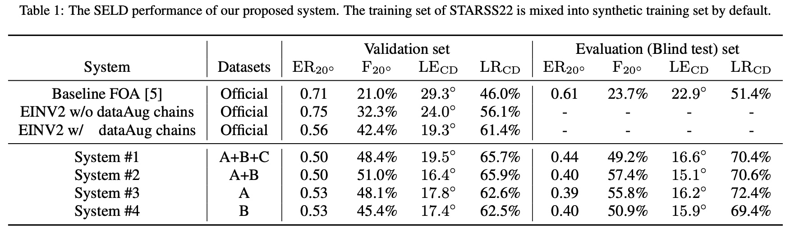
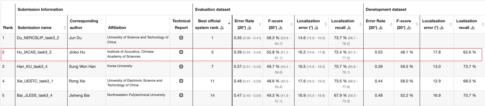

# Sound Event Localization and Detection for Real Spatial Sound Scenes: Event-Independent Network and Data Augmentation Chains 	

This repository contains the DCASE 2022 Challenge Task 3 code for our paper: Sound Event Localization and Detection for Real Spatial Sound Scenes: Event-Independent Network and Data Augmentation Chains [1]. 

For more information about the challenge, please refer to [*DCASE Task3 website*](https://dcase.community/challenge2022/task-sound-event-localization-and-detection-evaluated-in-real-spatial-sound-scenes).


## Introduction

Polyphonic sound event localization and detection (SELD) aims at detecting types of sound events with corresponding temporal activities and spatial locations. In DCASE 2022 Task 3, types of data transform from computationally generated spatial recordings to recordings of real-sound scenes. Our system submitted to the DCASE 2022 Task 3 is based on our previously proposed Event-Independent Network V2 (EINV2) and a novel data augmentation method. To mitigate the lack of real-scene recordings in the development dataset and the presence of sound events being unbalanced, we exploit FSD50K, AudioSet, and [*TAU Spatial Room Impulse Response Database (TAU-SRIR DB)*](https://zenodo.org/record/6408611) to generate simulated datasets for training. For more information, please read our papers [1,2].

Data augmentation methods are not provided yet.

## Description

Download and unzip the datasets [*STARSS22*](https://zenodo.org/record/6600531) and [*official synthetic datasets*](https://zenodo.org/record/6406873), the directory of two datasets looks like:

<pre>
./dataset
│
├── STARSS22
│   ├── foa_dev
│   ├── foa_eval
│   ├── LICENSE
│   ├── metadata_dev
│   ├── mic_dev
│   ├── mic_eval
│   └── README.md
│
└── synth_dataset
    └── official
        ├── foa
        ├── metadata
        └── mic

</pre>


## Quick Start

Hyper-parameters are stored in `./configs/ein_seld/seld.yaml`. You can change some of them, such as `batch_size`, `lr` and others. In addition, you need to set `dataset_dir` to your own dataset directory.

### 1. Preprocessing

It is needed to preprocess the data and label files. `.wav` files will be saved to `.h5` files. Label files will be preprocessed to track labels (`.h5` files) for training and frame labels (`.csv` file) for evaluating.  After downloading the data, directly run

```bash
bash ./scripts/preprocess.sh
```

Preprocessing for track labels separate labels into different tracks, each with up to one event and a corresponding DoA. The same event is consistently put in the same track. Mode details about track permutation invariant training (PIT) and Event Independent Network (EIN) are described in [2,3].

### 2. Traning

To train a model yourself, setup  `./configs/ein_seld/seld.yaml` and directly run

```bash
bash ./scripts/train.sh
```

The training is on an NVIDIA Geforce RTX 3090 GPU. If you have a GPU memory error, try to reduce the batch size. Only training with GPU is supported.

### 3. Inference

Inference part means predicting results and model outputs are saved in `./out_infer` folder. The saved results are the submission results for DCASE 2022 Task3. Directly run

```bash
bash ./scripts/infer.sh
```

### 4. Evaluation

Evaluation evaluate the generated submission result. Directly run

```python
python3 code/compute_seld_metrics.py
```

## Data augmentation

We update the data augmentation chains in this [repo](https://github.com/Jinbo-Hu/PSELDNets).

## Results

- The performance of our proposed models on the validation set.



- Our system obtains the 2nd rank in the team ranking. For more information about the result please refer to the [*website*](https://dcase.community/challenge2022/task-sound-event-localization-and-detection-evaluated-in-real-spatial-sound-scenes-results).



## FAQs
If you have any question, please email to hujinbo2019@gmail.com or report an issue here.

If you came across out of memory error, then try to reduce the batch size.

After downloading, you can delete the downloaded_packages folder to save some space.

## Cite

Please consider citing our paper if you find this code useful for your research. 

[1] Jinbo Hu, Yin Cao, Ming Wu, Qiuqiang Kong, Feiran Yang,  Mark D. Plumbley, and Jun Yang, "Sound Event Localization and Detection for Real Spatial Sound Scenes: Event-Independent Network and Data Augmentation Chains", submitted to DCASE 2022 Workshop. [*URL*](http://arxiv.org/abs/2209.01802)

[2]. Jinbo Hu, Yin Cao, Ming Wu, Qiuqiang Kong, Feiran Yang,  Mark D. Plumbley, and Jun Yang, “A Track-Wise Ensemble Event Independent Network for Polyphonic Sound Event Localization and Detection,”, in Proc. IEEE ICASSP 2022, 2022, pp. 9196–9200. [*URL*](https://arxiv.org/abs/2203.10228)

```
@inproceedings{hu2022,
  author={Hu, Jinbo and Cao, Yin and Wu, Ming and Kong, Qiuqiang and Yang, Feiran and Plumbley, Mark D. and Yang, Jun},
  booktitle={ICASSP 2022 - 2022 IEEE International Conference on Acoustics, Speech and Signal Processing (ICASSP)}, 
  title={A Track-Wise Ensemble Event Independent Network for Polyphonic Sound Event Localization and Detection}, 
  year={2022},
  pages={9196-9200},
  doi={10.1109/ICASSP43922.2022.9747283}}
```

## Reference

[3]. Yin Cao, Turab Iqbal, Qiuqiang Kong, Fengyan An, Wenwu Wang, Mark D. Plumbley, “An improved event-independent network for polyphonic sound event localization and detection,” in Proc. IEEE ICASSP 2021, 2021, pp. 885–889. [*URL*](https://arxiv.org/abs/2010.13092)

```
@inproceedings{cao2021,  
    title={An improved event-independent network for polyphonic sound event localization and detection},
    author={Cao, Y. and Iqbal, T. and Kong, Q. and An, F. and Wang, W. and Plumbley, M. D.},  
    booktitle={Proc. IEEE ICASSP 2021},  
    pages={885--889},  
    year={2021},
    }
```

## External links

Other codes may be helpful:

1. https://github.com/yinkalario/EIN-SELD

2. https://github.com/danielkrause/DCASE2022-data-generator

3. https://github.com/Jinbo-Hu/PSELDNets
